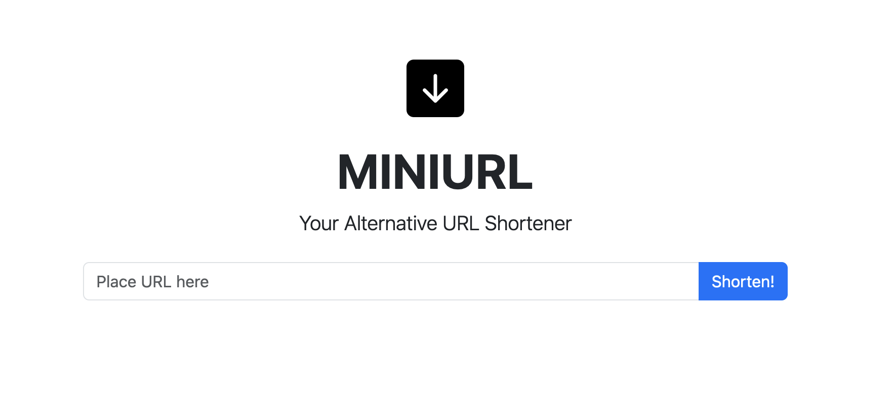

## MINIURL

MINIURL is URL Shortener alternative.

It also to answer a challange from [CodingChallanges](https://codingchallenges.fyi/challenges/challenge-url-shortener)

## Stack

- Rails
- PostgreSQL
- Stimulus

## How To Run Locally
- Fork this repo
- Clone to local
- Cd to repo by `cd minurl`
- Make sure you have a postgresql running in your local, then run `bin/rails db:create && bin/rails db:migrate`
- run `bin/rails s`

## How To Run Test

run `bundle exec rspec`